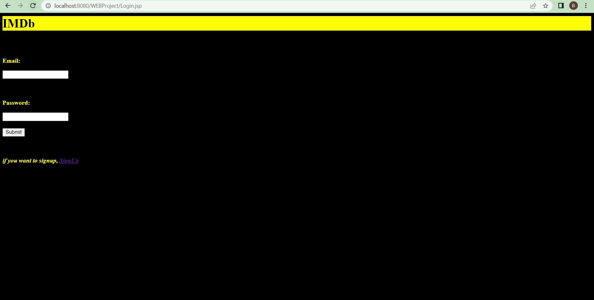
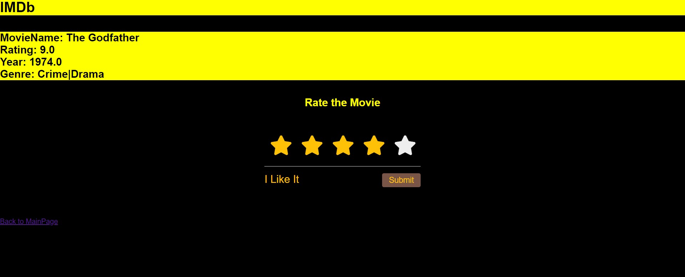
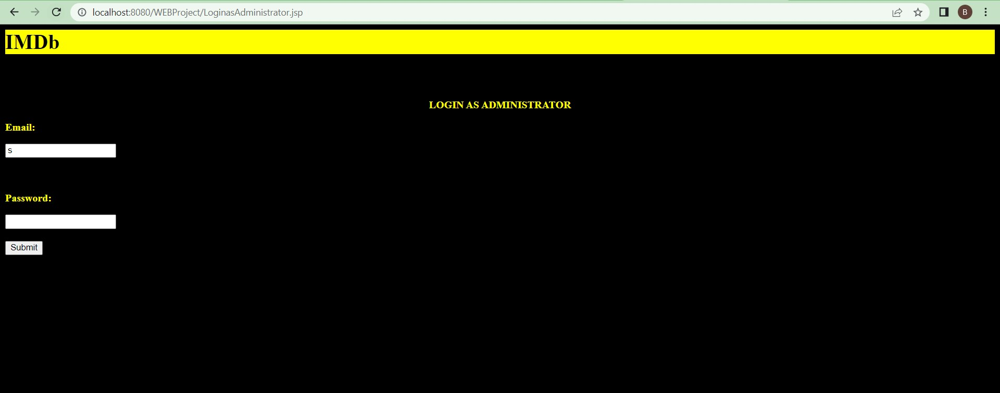

# IMDB-website
a java based web application deployed on Apache Tomcat.

- Web Engineering
- Fall 2021

Semester Project: Proposal 
===========================

Name:                 Ifrah Masood Khaliq 

Roll No.:	            BSEF19M548

Project Title: 	IMDb Website
-----------------------------
Modules:
--------

•	Signup

•	Login

•	Add person record

•	Search person record

•	Update person record

•	Delete person record

•	Add a Movie

•	Search a Movie through Title

•	Rate the Movie

•	List Down all the Movies with respect to Genres

•	List of top 5 movies of all time

•	Log out

•	Session management

# DATABASE IS CREATED IN MySQLYOG

Login Page
==========

SignUp Page
===========

Main Page
=========

Search and Rate the Movie
=========================

Login As Administrator
======================

- only i can access this

Administrator Portal
=====================

